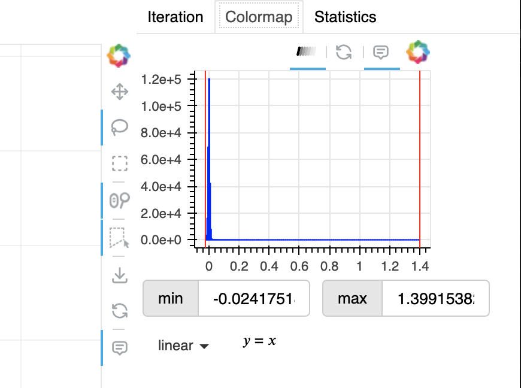
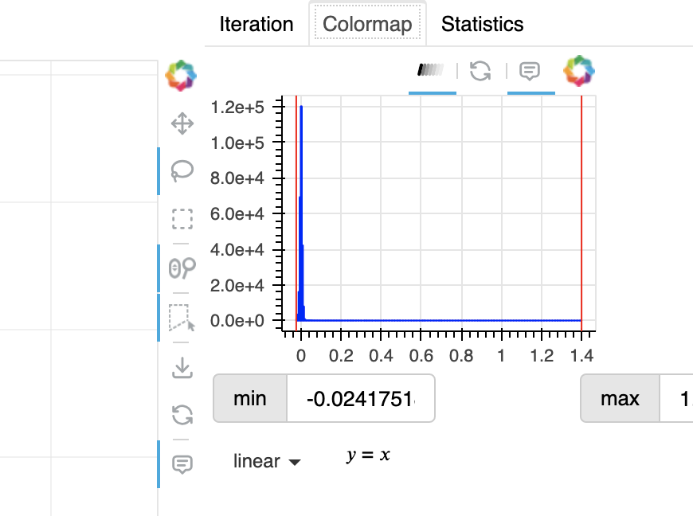
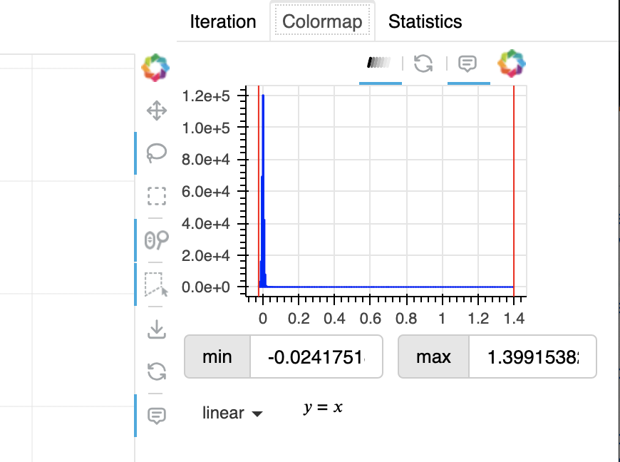
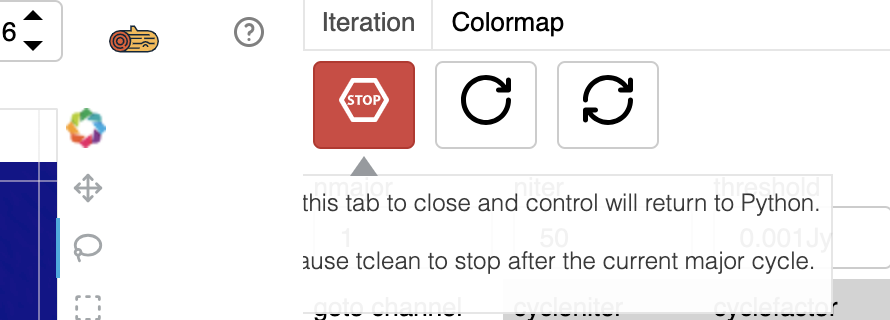
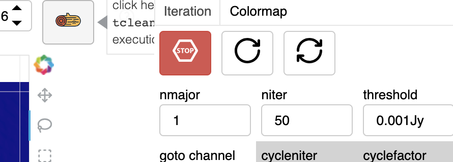

Introduction
============

Bokeh layout options are not great. The `GridBox <https://docs.bokeh.org/en/latest/docs/reference/models/layouts.html#bokeh.models.GridBox>`_
provides the most control, but it is complicated to lay out. The `row <https://docs.bokeh.org/en/latest/docs/reference/layouts.html#row>`_ and
`column <https://docs.bokeh.org/en/latest/docs/reference/layouts.html#column>`_ layouts are the simplest to use, but they are based on
the `FlexBox <https://docs.bokeh.org/en/latest/docs/reference/models/layouts.html#bokeh.models.FlexBox>`_ class which uses hueristics to
try to provide a nice layout with littl effort. This often works fine, but there are more than a few corner cases.

Adding Tooltips
===============

Bokeh `Tooltips <https://docs.bokeh.org/en/latest/docs/user_guide/interaction/tooltips.html>`_ can be added to **some** widgets (i.e.
those whose API has been expanded to include a tooltip parameter). When a :code:`tooltip` is supplied, it places a *circle with a
question mark* icon beside the widget. When the icon is moused over, the tooltip is displayed with an arrow pointing at the
widget the tooltip describes. It seems like there are both good and bad points to this approach. I first tried to add tooltips to
the `TextInput <https://docs.bokeh.org/en/latest/docs/user_guide/interaction/widgets.html#textinput>`_ widget. To minimize the
amount of vertical needed, I used the :code:`prefix` argument to add a label at the beginning of the text entry field instead of
specifying a :code:`label`. If no label is supplied, the tooltip is **not** displayed.

TipButton
---------

Bokeh also has a native `HelpButton <https://docs.bokeh.org/en/latest/docs/user_guide/interaction/widgets.html#helpbutton>`_.
This provides the tooltip behavior as a button. When the button is moused over the tooltip is displayed. When the button is
clicked, the tooltip is displayed **until it is dismissed**. This is close to the behavior I desired for a tooltip so I created
a :code:`TipButton` which displays the tooltip if the mouse *lingers* over the button for 1.5 seconds (by default), but if the
button is clicked it invokes any callbacks attached to the button. This solved the tooltip problem for buttons.

Tip
----

I wanted to be able to have tooltips for any widgets. My plan was to have a layout object which could be used to enclose another
widget and display the widget's tooltip when the mouse *lingered* over the layout. I first implemented :code:`Tip` based upon the
`Row <https://docs.bokeh.org/en/latest/docs/reference/models/layouts.html#bokeh.models.Row>`_ layout. This seemed fine until
I had tow :code:`Tip` widgets in a :code:`Row` . When the individual widgets were included in the row::

  row( self._cm_adjust['left input'],
       self._cm_adjust['right input'] )

The display was fine:

However, nested :code:`row` widgets::

  row( row(self._cm_adjust['left input']),
       row(self._cm_adjust['right input']) )

or a row of my *row-based* :code:`Tip` widgets caused the layout to change:

To resolve this problem, I had to create a :code:`Tip` widget *based upon* but **not derived** from
`LayoutDOM <https://docs.bokeh.org/en/latest/docs/reference/models/layouts.html#bokeh.models.LayoutDOM`_ . This new :code:`Tip`
widget does not have all of the layout properties that :code:`LayoutDOM` provides, and it only accepts one :code:`child` parameter::

  row( Tip( self._cm_adjust['left input'],
            tooltip=Tooltip( content=HTML("set minimum clip here or drag the left red line above"),
                             position="top" ) ),
       Tip( self._cm_adjust['right input'],
            tooltip=Tooltip( content=HTML("set maximum clip here or drag the right red line above"),
                             position="top" ) ) )

This change resolved the formatting issues:

Layout Quirks
=============

I had many problems getting the layout of the interactive clean app into a satisfactory state. Moving the statistics display into the
tabbed area at the right of the cube plot was part of the solution. This prevented the statistics and the convergence info tab
from being rendered on top of each other.

Tooltips
--------

However, the choice of layout affects the display of tooltips. The initial layout used two columns. One containing the cube display
and the convergence/spectrum plot, and the second containing the tabbed area at the right of the cube, the :code:`tclean` controls,
and the slider for changing channels. Unfortunately, this approach resulted in the tooltips being clipped along the column boundaries:

or this example:

