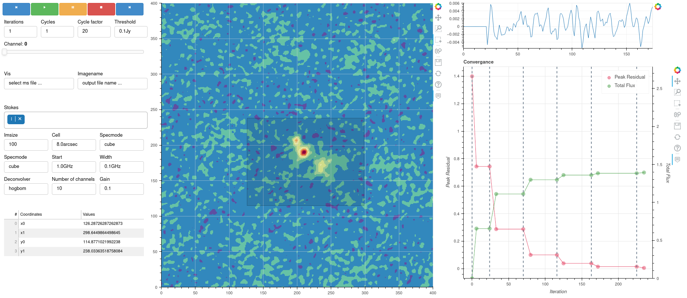

Interactive Clean
======================

.. currentmodule:: applications

The visualization infrastructure of CASA will be built out by completing pathfinder
applications. These applications will build team knowledge and expand our codebase
as we encounter new opportunities and challenges. Interactive clean is the first
pathfinder application for the :ref:`terminal usage setting <design-terminal-usage>`.
This is an important use case because it pushes the boundraries of what is possible
in this usage setting.

Infrastructure
----------------------

For this use case, we had certain requirements that stretched the capabilities of :xref:`bokeh`
browser plotting:

* two directional communication was necessary between Python and the
  interactive clean display in the web browser
* state needed to be returned to the Python session where :code:`tclean` is running

:xref:`bokeh`'s solution for the first issue is to serve the browser code from a
``bokeh server`` process. Unfortunately, this python process is separate from the
:code:`tclean` process, and interactive clean requires an ongoing dialog between
the imageing code in Python and the display the user interacts with in a browser.

To solve these problems, we introduced a :xref:`websocket` based infrastructure
to handle the update of browser display as :code:`tclean` proceeds.

Implementation
---------------------

While we are only in the prototyping phase of the interactive clean application, we have
prototyped a GUI that will go beyond what is currently possible with current
implementations of interactive clean, as show in this figure:

The interactive clean application has three main panel groups: control group, configuration group,
and visualization group.  The control group provides interactive control of `tclean` allowing the
user to step through the `tclean` process at the desired step resolution. Using the control panel,
the user has options such `play`, `pause`, `step`, or `stop` as well as the ability to set properties
such as the number of cycles , the interations, and the threshold value to use. A slider is also
include that allows the user to cycle through the visualization for each channel in a smooth,
responsive manner.

The configuration panel allows the user to set the minimal input parameters to `tclean` as well as
displaying information about the image cube being used. In the future there are plans to add an
advanced option to allow the user to access all of the tclean paramenters.

The visualization panels display the the current .image file as well as any masks that may be applied.
For each `tclean` cycle information on the residual and total flux are displayed as well as histogram
representing the spectral information at the current position when mousing over the image. All three
displays are updated for each finished cycle. As mentioned previously the display for each channel can
be accessed using the controls panel slider. There will be an option to scan and display different as
well polarization in a future prototype.

