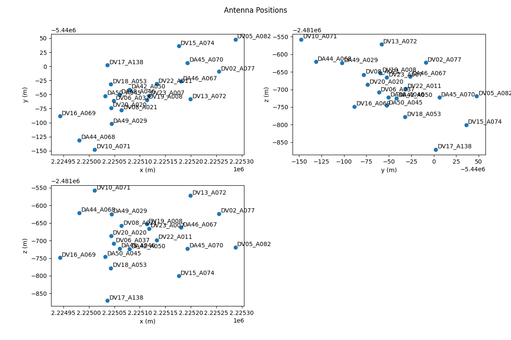
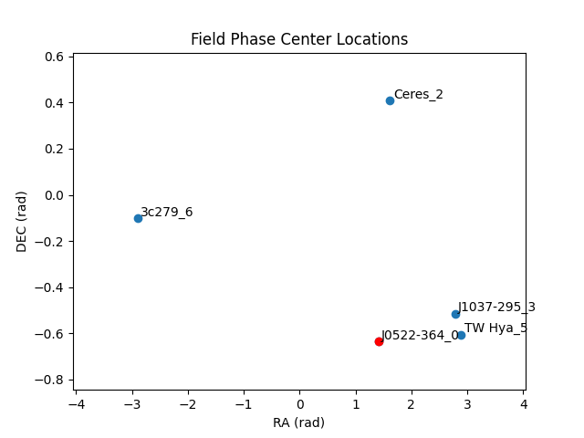

MsRaster
========

.. currentmodule:: applications

MsRaster is an application for 2-dimensional visualization and flagging of
visibility and spectrum data.

Infrastructure
--------------

Like :doc:`interactive_clean`, MsRaster utilizes the :xref:`bokeh`
backend for plotting.  Bokeh has built-in plot tools allowing the user to zoom,
pan, select regions, inspect data values, and save the plot. Additional
libraries are used in MsRaster for data I/O, logging, plotting, and interactive
dashboards:

.. list-table::
   :class: borderless
   :align: center

   * - .. image:: _static/bokeh_logo.svg
          :width: 100
     - .. image:: _static/xradio_logo.webp
          :width: 100
     - .. image:: _static/graphviper_logo.jpeg
          :width: 100
     - .. image:: _static/hvplot.png
          :width: 60
     - .. image:: _static/holoviews.png
          :width: 100
     - .. image:: _static/panel.png
          :width: 100

* :xref:`xradio` (Xarray Radio Astronomy Data I/O) implements the MeasurementSet
  v4.0.0 schema using :xref:`xarray` to provide an interface for radio astronomy
  data

* `toolviper <https://github.com/casangi/toolviper>`_ is used for creating the
  Dask.distributed client and for logging

* `graphviper <https://github.com/casangi/graphviper>`_ is used for Dask-based
  MapReduce to calculate statistics

* Holoviz library :xref:`hvplot` allows easy visualization of :xref:`xarray`
  data objects as interactive :xref:`bokeh` plots

* Holoviz library :xref:`holoviews` allows the ability to easily layout and
  overlay plots

* Holoviz library :xref:`panel` streamlines the development of apps and
  dashboards for the raster plots

Implementation
--------------

MsRaster creates raster plots for the user to view interactively or save to
disk. The app can be used in three ways from Python:

* create raster plots exported to .png files

* create interactive Bokeh raster plots shown in a browser window

* show a GUI dashboard in a browser window for selecting plot parameters to create
  interactive Bokeh raster plots

Data Exploration
````````````````

:xref:`xradio` allows the user to explore MeasurementSet data with a summary of
its metadata, and to make plots of antenna positions and phase center locations
of all fields. These features can be accessed in MsRaster, as well as the
ability to list :xref:`data_groups` and antenna names to aid in selection.

Raster Plots
````````````

MsRaster gives the user flexibility to set plot axes and the complex component,
select data, aggregate along one or more data dimensions, iterate along a data
dimension, style the plot, and layout multiple plots in a grid.  All parameters
available from the MsRaster function calls are also available in the interactive
GUI.

Installation
------------

Requirements
````````````

- Python 3.11 or greater

- :xref:`xradio`

  - optionally with `python-casacore <https://casacore.github.io/python-casacore/>`_
    or `casatools <https://casadocs.readthedocs.io/en/stable/api/casatools.html>`_
    to enable conversion from MSv2 to MSv4

- `toolviper <https://github.com/casangi/toolviper>`_ (installed with XRADIO)

- `graphviper <https://github.com/casangi/graphviper>`_

- :xref:`hvplot`

To save plots, additional packages are required:

- `Selenium <https://github.com/seleniumhq/selenium>`_

- geckodriver for firefox, or chromedriver for chromium


.. _install_msraster:

Install
```````

You may want to use the conda environment manager from
`miniforge <https://github.com/conda-forge/miniforge>`_ to create a clean,
self-contained runtime where casagui and the MsRaster dependencies can be
installed::

  conda create --name casagui python=3.12 --no-default-packages
  conda activate casagui

Install required packages::

  pip install casagui xradio graphviper hvplot

To install **xradio** with **python-casacore** for MSv2 conversion::

  pip install "xradio[python-casacore]"

.. note::
   On macOS it is required to **pre-install** python-casacore using
   ``conda install -c conda-forge python-casacore``.

It is also possible to use
`casatools <https://casadocs.readthedocs.io/en/stable/api/casatools.html>`_
as the backend for reading the MSv2. See the
`XRADIO casatools setup guide <https://xradio.readthedocs.io/en/latest/measurement_set/guides/backends.html>`_
for more information.

Install packages to save plots to file (**choose one**)::

  conda install -c conda-forge selenium firefox geckodriver
  conda install -c conda-forge selenium python-chromedriver-binary
  pip install selenium chromedriver-binary

Dask.distributed Scheduler
--------------------------

For parallel processing workflows, you can set up a local Dask cluster using
:xref:`toolviper`. Dask.distributed is a centrally managed, distributed, dynamic
task scheduler.

**Prior to** using MsRaster, you may elect to start a Dask Client (local
machine) or a Dask LocalCluster (cluster). For a local client, set the number of
cores and memory limit per core to use. The logging level for the main thread
and the worker threads may also be set (default "INFO"). When plotting small
datasets, however, this adds overhead which may make plotting slower than
without the client.

:xref:`toolviper` has an interface to create and access a local or distributed
client.  See the
`client tutorial <https://github.com/casangi/toolviper/blob/main/docs/client_tutorial.ipynb>`_
and ``help(local_client)`` or ``help(distributed_client)`` for more information.

.. warning::
   If Python scripts are used to make plots, the client should not be created in
   the main thread.  For more details, see
   `Standalone Python scripts <https://docs.dask.org/en/stable/scheduling.html#standalone-python-scripts>`_
   in the Dask Scheduling documentation.

Using MsRaster to Create Plots
------------------------------

In this simple example with no GUI, we import MsRaster, construct an MsRaster
object, create a raster plot with default parameters, and show the interactive
Bokeh plot in a browser tab::

    from casagui.apps import MsRaster
    msr = MsRaster(ms=myms)
    msr.plot()
    msr.show()

.. _construct_msraster:

Construct MsRaster Object
`````````````````````````
.. code:: python

    >>> msr = MsRaster(ms=None, log_level='info', show_gui=False)

* ``ms`` (str): path to MSv2 (usually .ms extension) or MSv4 (usually .zarr
  extension) file. Required when show_gui=False.
* ``log_level`` (str): logging threshold. Options include 'debug', 'info',
  'warning', 'error', 'critical'.
* ``show_gui`` (bool): whether to launch the interactive GUI in a browser tab.

MsRaster can be constructed with the ``ms`` path to a MSv2 or MSv4 file. If a
MSv2 path is supplied, it will automatically be converted to the MSv4 zarr
format in the same directory as the MSv2 with the extension **.ps.zarr**. For
more information on the MSv4 data format, see the XRADIO
`Measurement Set Tutorial <https://xradio.readthedocs.io/en/latest/measurement_set/tutorials/measurement_set_tutorial.html>`_.

.. warning::
   MSv2 files will be converted to zarr using the xradio default partitioning:
   **data_description (spectral window and polarization setup), observation
   mode, and field**.  If the MSv2 to be converted has numerous fields, such as
   a mosaic, it is best to
   `convert the MSv2 to zarr <https://xradio.readthedocs.io/en/latest/measurement_set/schema_and_api/measurement_set_api.html#xradio.measurement_set.convert_msv2_to_processing_set>`_
   without field partitioning prior to using MsRaster.

The ``log_level`` can be set to the desired level, with log messages output to
the Python console.  There is currently no log file option.

At construction, we decide whether to create the plots using MsRaster functions
(``showgui=False``) or using the interactive GUI (``showgui=True``).  When the
GUI is shown, using MsRaster functions does not update the GUI widget selections
or the plot. The ``ms`` parameter is required when ``showgui=False``, but
optional when this path can be set in the GUI.

.. _explore_data:

Explore MS Data
```````````````

Several MsRaster functions are available for exploring the MeasurementSet. The
**.zarr** file is opened as an :xref:`xradio` ProcessingSet, which is an :xref:`xarray`
DataTree composed of MSv4s (see
`Measurement Set Tutorial <https://xradio.readthedocs.io/en/latest/measurement_set/tutorials/measurement_set_tutorial.html>`_
for more information). :xref:`xradio` has added custom functions for data
exploration in its ProcessingSetXdt class, which are available in MsRaster.

.. _data_groups:

Some functions require that the :xref:`data_groups` name is specified. Data groups are
a set of related visibility/spectrum data, uvw, flags, and weights. Use
``data_groups()`` to get a list of the data groups available in the MS::

    >>> msr.data_groups()
    {'base', 'model', 'corrected'}

.. _summary:

Use ``summary()`` to view ProcessingSetXdt metadata for a specified
:xref:`data_groups` name, displayed in a tabular format.  These column names and
values can be used to do selection for a plot::

    >>> msr.summary(data_group='base', columns=None)
                        name                                                                            intents              shape polarization                        scan_name                         spw_name     field_name   source_name line_name                       field_coords  start_frequency  end_frequency  
    0  sis14_twhya_selfcal_0 [CALIBRATE_BANDPASS#ON_SOURCE, CALIBRATE_PHASE#ON_SOURCE, CALIBRATE_WVR#ON_SOURCE]  (20, 210, 384, 2)     [XX, YY]                              [4] ALMA_RB_07#BB_2#SW-01#FULL_RES_0  [J0522-364_0] [J0522-364_0]        []  [fk5, 5h22m57.98s, -36d27m30.85s]     3.725331e+11   3.727669e+11  
    1  sis14_twhya_selfcal_1 [CALIBRATE_BANDPASS#ON_SOURCE, CALIBRATE_PHASE#ON_SOURCE, CALIBRATE_WVR#ON_SOURCE]  (20, 171, 384, 2)     [XX, YY]                             [33] ALMA_RB_07#BB_2#SW-01#FULL_RES_0      [3c279_6]     [Unknown]        []  [fk5, 12h56m11.17s, -5d47m21.52s]     3.725331e+11   3.727669e+11  
    2  sis14_twhya_selfcal_2    [CALIBRATE_AMPLI#ON_SOURCE, CALIBRATE_PHASE#ON_SOURCE, CALIBRATE_WVR#ON_SOURCE]  (20, 190, 384, 2)     [XX, YY]                              [7] ALMA_RB_07#BB_2#SW-01#FULL_RES_0      [Ceres_2] [J1037-295_2]        []   [fk5, 6h10m15.95s, 23d22m06.91s]     3.725331e+11   3.727669e+11  
    3  sis14_twhya_selfcal_3                               [CALIBRATE_PHASE#ON_SOURCE, CALIBRATE_WVR#ON_SOURCE]  (80, 210, 384, 2)     [XX, YY] [10, 14, 18, 22, 26, 30, 34, 38] ALMA_RB_07#BB_2#SW-01#FULL_RES_0  [J1037-295_3]    [TW Hya_3]        [] [fk5, 10h37m16.08s, -29d34m02.81s]     3.725331e+11   3.727669e+11  
    4  sis14_twhya_selfcal_4                                                         [OBSERVE_TARGET#ON_SOURCE] (270, 210, 384, 2)     [XX, YY]         [12, 16, 20, 24, 28, 36] ALMA_RB_07#BB_2#SW-01#FULL_RES_0     [TW Hya_5]     [3c279_4]        [] [fk5, 11h01m51.80s, -34d42m17.37s]     3.725331e+11   3.727669e+11

If a subset of columns is of interest, set the ``columns`` parameter to one or
more column names::

    >>> msr.summary(data_group='base', columns='intents')
    >>> msr.summary(data_group='base', columns=['spw_name', 'shape'])
    >>> msr.summary(data_group='base', columns=['spw_name', 'start_frequency', 'end_frequency'])

To view the summary information grouped by MSv4, set ``columns='by_ms'`` (only
the first MS is shown here)::

    >>> msr.summary(data_group='base', columns='by_ms')
    MSv4 name: sis14_twhya_selfcal_0
    intent: ['CALIBRATE_BANDPASS#ON_SOURCE', 'CALIBRATE_PHASE#ON_SOURCE', 'CALIBRATE_WVR#ON_SOURCE']
    shape: 20 times, 210 baselines, 384 channels, 2 polarizations
    polarization: ['XX' 'YY']
    scan_name: ['4']
    spw_name: ALMA_RB_07#BB_2#SW-01#FULL_RES_0
    field_name: ['J0522-364_0']
    source_name: ['J0522-364_0']
    line_name: []
    field_coords: (fk5) 5h22m57.98s -36d27m30.85s
    frequency range: 3.725331e+11 - 3.727669e+11

.. _antennas:

The ``antennas()`` function returns a list of antenna names, which can be used
to select baseline, antenna1, or antenna2. This function has been combined with
the :xref:`xradio` ProcessingSetXdt function to plot the antenna positions,
optionally labeled by name:

    >>> antenna_names = msr.antennas(plot_positions=False, label_antennas=False)
    >>> print(antenna_names)
    ['DA42_A050', 'DA44_A068', 'DA45_A070', 'DA46_A067', 'DA48_A046', 'DA49_A029', 'DA50_A045',
    'DV02_A077', 'DV05_A082', 'DV06_A037', 'DV08_A021', 'DV10_A071', 'DV13_A072', 'DV15_A074',
    'DV16_A069', 'DV17_A138', 'DV18_A053', 'DV19_A008', 'DV20_A020', 'DV22_A011', 'DV23_A007']

When plotting antenna positions with ``label_antennas=False``, the antenna
names can be shown by hovering over the antenna position. Sample antenna plot
with ``label_antennas=True``:



MsRaster includes the :xref:`xradio` ProcessingSetXdt function
``plot_phase_centers()`` to plot the phase center locations of all fields in a
data group. You may optionally label the fields by name::

    >>> msr.plot_phase_centers(data_group='base', label_fields=False)

When ``label_fields=False``, the central field is highlighted in red based on
the closest phase center calculation, and the legend shows the central field
name. Otherwise, all fields are named and the central field is red. Sample plot
with ``label_fields=True``:




.. _style_plot:

Style Raster Plots
``````````````````

By default, MsRaster uses the *Viridis* colormap for unflagged data and the
*Reds* colormap for flagged data, and shows colorbars for both types of data.
Use the ``set_style_params()`` function to change these settings. These style
settings will then be used for all plots for the MsRaster object::

    >>> msr.set_style_params(unflagged_cmap='Viridis', flagged_cmap='Reds', show_colorbar=True,
    show_flagged_colorbar=True)

Use ``colormaps()`` to get the list of available colormaps, which are the
same ones used in :doc:`interactive_clean`::

    >>> msr.colormaps()
    ['Blues', 'Cividis', 'Greens', 'Greys', 'Inferno', 'Magma', 'Oranges', 'Plasma', 'Purples',
    'Reds', 'Turbo', 'Viridis']

It is expected that in the future, additional style settings will be available,
such as fonts for plot labels. It is also possible that in the future these
settings will be able to be saved in a config.py file.

.. _create_plot:

Create Raster Plot
``````````````````

Use ``plot()`` to create each raster plot, which can then be shown (see :ref:`show_plot`) or saved (see :ref:`save_plot`)::

    >>> msr.plot(x_axis='baseline', y_axis='time', vis_axis='amp', selection=None,
    aggregator=None, agg_axis=None, iter_axis=None, iter_range=None, subplots=None,
    color_mode=None, color_range=None, title=None, clear_plots=True)

* ``x_axis`` and ``y_axis`` (str): select the axes to plot from the data
  dimensions **'time', 'baseline'** (**'antenna_name'** for spectrum data),
  **'frequency',** and **'polarization'**. For spectrum data, **'baseline'** is
  equivalent to **'antenna_name'** since it is the default ``x_axis``.
    * Default x_axis: **baseline**
    * Default y_axis: **time**

* ``vis_axis`` (str): The complex component of the visibility data has options
  **'amp', 'phase', 'real',** and **'imag'**. For spectrum data, only **'amp'**
  and **'real'** are valid, with **'amp'** equivalent to **'real'** since it is
  the default ``vis_axis``.
    * Default vis_axis: **amp**

* ``selection`` (None, dict): select data using a dictionary of keyword/value
  pairs. Selections may be made from the :xref:`xradio`
  ProcessingSetXdt or MSv4 by **value**:

  * **ProcessingSetXdt**: use the summary column names as keys and the column
    value(s) as valid options (see :ref:`summary() <summary>`). Since the
    ProcessingSetXdt summary is a `Pandas <https://pandas.pydata.org/>`_
    DataFrame, selection can also be done as a Pandas query with keyword
    ``'query'``. The :xref:`data_groups` name for correlated data may also be
    selected (see :ref:`data_groups() <data_groups>`). Some selections will be
    made automatically if not user-selected (see note below). Example selections:

    * selection = {'data_group': 'corrected', 'intents': 'OBSERVE_TARGET#ON_SOURCE',
      'field_name': 'TW Hya_5'}
    * selection = {'query': 'field_name=["3c279_6", "TW Hya_5"], scan_name=["33", "36"]'}
    * selection = {'query': 'start_frequency > 100e9 AND end_frequency < 200e9'}
 
  * **MSv4**: select the data dimensions.  Some selections will be made
    automatically if not user-selected (see note below):

    * ``'time'``: ???
    * ``'frequency'``: ???
    * ``'baseline'``, ``'antenna1'`` and ``antenna2'``: select antenna names or
      baselines as 'ant1_name & ant2_name' (see :ref:`antennas() <antennas>`).
    * ``'polarization'``: use *summary(columns='polarization')* for valid
      options (see :ref:`summary() <summary>`).

  * Default selection: None (use automatic selection). 

.. note::
  * **Automatic selection**: Since MsRaster creates a 2D plot from 4D data, some
    selections must be done automatically if not selected by the user. These
    selections include:

    * **spw_name**: for consistent data shapes, the first spectral window (by
      spectral_window_id) is selected.
    * **data_group**: default 'base'.
    * **data dimensions**:  the dimensions not chosen for ``x_axis``,
      ``y_axis``, aggregation ``agg_axis`` or iteration ``iter_axis`` are
      automatically selected. After user selections are applied, the set of
      dimension values are sorted, and the first is used. Time and frequency are
      numeric values. For baseline, names are formed as 'ant1_name & ant2_name'
      strings and sorted, then the first pair in the list is selected. For
      polarization, the names are converted to
      `casacore Stokes enum <https://github.com/casacore/casacore/blob/5a8df94738bdc36be27e695d7b14fe949a1cc2df/measures/Measures/Stokes.h#L64>`_
      values, sorted, and the first in the list is selected and converted back
      to a name for value selection.

* ``aggregator`` (None, str): the reduction function to apply along the
  ``agg_axis`` dimension(s) of all correlated data in the data group
  (VISIBILITY/SPECTRUM, WEIGHT, and FLAG). Aggregator options include **'max',
  'mean', 'min', 'std', 'sum'**, and **'var'**. The reduction is applied after
  the ``vis_axis`` component is applied. Flags and weights are not used in the
  aggregation but are aggregated.
    * Default aggregator: None

* ``agg_axis`` (None, str, list): which dimension(s) to apply the ``aggregator``
  across. Cannot include ``x_axis`` or ``y_axis``. Ignored if
  ``aggregator=None``. The entire dimension(s) are aggregated. If agg_axis is a
  single dimension, the remaining dimension is selected automatically as
  described above. If ``agg_axis=None``, *all* remaining dimensions are
  aggregated.
    * Default agg_axis: None

* ``iter_axis`` (None, str): dimension along which to iterate to create multiple
  plots. Cannot be ``x_axis`` or ``y_axis``. Select the iteration index range
  with ``iter_range``.
    * Default iter_axis: None

* ``iter_range`` (None, tuple): (start, end) inclusive index values for creating
  iteration plots. Use (0, -1) for all iterations.  Warning: you may trigger a
  MemoryError with many iterations.  Iterated plots can be shown or saved in a
  grid (see ``subplots``) or saved individually (see :ref:`save_plot`).
    * Default iter_range: None (equivalent to (0, 0), first iteration only)

* ``subplots`` (None, tuple): set a plot layout of (rows, columns). Use with
  ``iter_axis`` and ``iter_range``, or ``clear_plots=False``.  If the layout
  size is less than the number of plots, ``subplots`` will limit the plots in
  the layout. Similarly, if  the number of plots is less than the ``subplots``
  size, the plots will appear in the layout according to the number of columns
  but fewer rows. The last ``subplots`` setting will be used in :ref:`show_plot`
  and :ref:`save_plot`.
    * Default subplots: None (single plot, equivalent to (1, 1))

* ``color_mode`` (None, str): Whether to limit the colorbar range. Options
  include **None** (use data limits), **'auto'** (calculate limits for
  amplitude), and **'manual'** (use ``color_range``). **'auto'** is equivalent
  to None if ``vis_axis`` is not **'amp'**.  **'manual'** is equivalent to None
  if ``color_range=None``. Automatic limits for amplitudes are calculated from
  statistics for the unflagged data in the spectral window, which use 
  :xref:`graphviper` MapReduce for fast computation. The range is clipped to
  3-sigma limits to brighten weaker data values.
    * Default color_mode: None (use data limits)

* ``color_range`` (None, tuple): (min, max) of colorbar to use if
  ``color_mode='manual'``, else ignored.
    * Default color_range: None (use data limits)

* ``title`` (None, str): Plot title. Options include None, **'ms'** to generate
  a title from the ``ms`` name appended with ``iter_axis`` value (if any), or a
  custom title string.
    * Default title: None (no plot title).

* ``clear_plots`` (bool): whether to clear the list of previous plot(s). Set to
  False to create multiple plots and show them in a layout with ``subplots``.
  This option is not currently available in the interactive GUI.
    * Default clear_plots: True (remove previous plots)

**Examples**:

* Aggregation: time vs. baseline averaged over frequency, with the first
  polarization selected automatically:

    >>> msr.plot(x_axis='baseline', y_axis='time', aggregator='mean', agg_axis='frequency')

* Aggregation: time vs. baseline averaged over frequency, with polarization
  selection:

    >>> msr.plot(x_axis='baseline', y_axis='time', selection={'polarization': 'YY'},
    aggregator='mean', agg_axis='frequency')

* Aggregation: time vs. baseline averaged over frequency and polarization
  (equivalent to ``agg_axis=['frequency', 'polarization']``):

    >>> msr.plot(x_axis='baseline', y_axis='time', aggregator='mean')

* Iteration layout: time vs. baseline for the first six frequencies in 2 rows,
  with the first polarization selected automatically:

    >>> msr.plot(iter_axis='frequency', iter_range=(0, 5), subplots=(2, 3))

* Multiple plots layout: time vs. baseline for 'amp' and 'phase' in one row,
  with the first frequency and polarization selected automatically:

    >>> msr.plot(vis_axis='amp')
    >>> msr.plot(vis_axis='phase', subplots=(1, 2), clear_plots=False)

* Aggregation and iteration layout: time vs. frequency for the max across
  baselines, iterated over all polarizations, in a 2x2 layout with a clipped
  colorbar range:

    >>> msr.plot(x_axis='frequency', y_axis='time', vis_axis='amp', aggregator='max',
    agg_axis='baseline', iter_axis='polarization, iter_range=(0, -1), subplots=(2, 2),
    color_mode='auto')

.. _show_plot:

Show Raster Plot
````````````````

After a plot is created (see :ref:`create_plot`), it may be shown in a browser
tab with ``show()``, which has no parameters:

    >>> msr.show()

If multiple plots were created (with ``iter_axis`` or ``clear_plots=False``) in
a ``subplots`` layout, the plots are connected so that the Bokeh plot tools such
as pan and zoom act on all plots in the layout.

To show the plot, :xref:`holoviews` renders the plot to a :xref:`bokeh` figure,
then Bokeh show() saves the plot to an HTML file in a temporary directory and
automatically opens the file in the browser.

.. _save_plot:

Save Raster Plot
````````````````

After a plot is created (see :ref:`create_plot`), it may be saved to a file with
``save()``.

    >>> msr.save(filename='', fmt='auto', width=900, height=600)

* ``filename`` (str): Name of file to save. Default '': the plot will be saved
  as {ms}_raster.{ext}. If fmt is not set, plot will be saved as .png.
* ``fmt`` (str): Format of file to save ('png', 'svg', 'html', or 'gif'). Default
  'auto': inferred from filename extension.
* ``width`` (int): width of exported plot.
* ``height`` (int): height of exported plot.

As in :ref:`show_plot`, multiple plots can be saved in a layout using the
``subplots`` parameter in the :ref:`create_plot` ``plot()`` function. This
layout plot will be saved to a single file with ``filename``.

However, if iteration plots were created and ``subplots`` is a single plot
(None or (1, 1)), the iteration plots will be saved individually with a plot
index appended to the filename according to the ``iter_range`` index range:
{``filename``}_{index}.{ext}.

When ``save()`` is called, as with ``show()`` the plot is exported to an HTML
file. If the file format is .png, the exported plot will be rendered as a
PNG, which currently requires Selenium and either firefox and geckodriver
or chromium browser and chromedriver (see :ref:`install_msraster`).

.. warning::
   If you have rendered the plot with ``show()``, it is much faster to save
   the plot with the Bokeh save tool than with ``save()``.

**Iteration save() examples**:

* Create plots for the first four frequencies, and save them in a 2x2 layout:

    >>> msr.plot(iter_axis='frequency', iter_range=(0, 3), subplots=(2, 2))
    >>> msr.save(filename='iter_freq_layout.png')

* Create plots for a range of frequencies, and save them *individually* with an
  index (in this example: iter_freq_10.png, iter_freq_11.png, iter_freq_12.png,
  iter_freq_13.png):

    >>> msr.plot(iter_axis='frequency', iter_range=(10, 13))
    >>> msr.save(filename='iter_freq.png')

* Create plots for all polarizations, and save them individually with an index
  (in this case, iter_pol_0.png, iter_pol_1.png, etc. depending on the number of
  polarizations):

    >>> msr.plot(iter_axis='polarization', iter_range=(0, -1))
    >>> msr.save(filename='iter_pol.png')

Use Interactive GUI
```````````````````

As mentioned in :ref:`construct_msraster`, use ``showgui=True`` to launch the
interactive GUI.  In this case, an ``ms`` path can be supplied but is not
required.

.. code:: python

    >>> msr = MsRaster(ms=None, log_level='info', show_gui=True)

The GUI will immediately launch in a browser tab.  If ``ms`` is set, a plot with
default parameters is created and shown in the GUI.

.. image:: _static/msraster_gui.png

Each section of the plot inputs on the right side of the GUI corresponds to the
MsRaster plot parameters:

* :ref:`construct_msraster` parameters:

  * **Select file**: ``ms``

* :ref:`style_plot` parameters:

  * **Plot style**: ``unflagged_cmap``, ``flagged_cmap``, ``show_colorbar``,
    ``show_flagged_colorbar``

* :ref:`create_plot` parameters:

  * **Plot axes**: ``x_axis``, ``y_axis``, ``vis_axis``
  * **Selection**: ``selection``
  * **Aggregation**: ``aggregator``, ``agg_axis``
  * **Iteration**: ``iter_axis``, ``iter_range``, ``subplots``
  * **Plot title**: ``title``

**Plot**: the ``Plot`` button will change from outline to solid when the plot
inputs change. Click ``Plot`` to render the plot.

.. note::
   Iterated plots in a layout will be shown in a Bokeh plot in a **new browser
   tab**. There is currently no way to create multiple plots in the GUI except
   by iteration.
