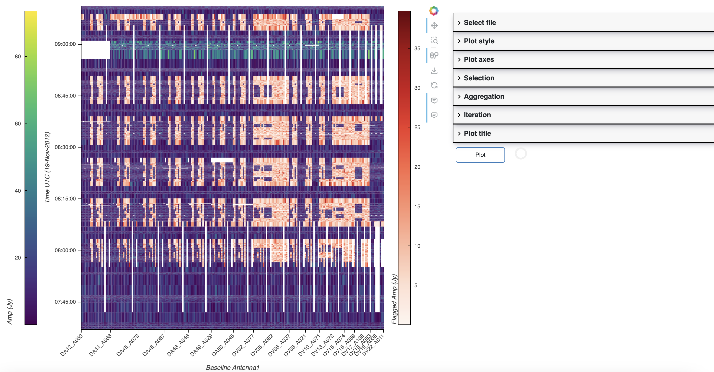

MsRaster
========

.. currentmodule:: applications

MsRaster is an application for 2-dimensional visualization and flagging of visibility and 
spectrum data.

Infrastructure
----------------------

Like :ref:`Interactive Clean <interactive_clean>`, MsRaster utilizes the :xref:`bokeh`
backend for plotting.  Bokeh has built-in plot tools allowing the user to zoom, pan,
select regions, inspect data values, and save the plot. Additional libraries are
used in MsRaster for data I/O, plotting, and interactive dashboards:

* :xref:`xradio` (Xarray Radio Astronomy Data I/O), which implements the MeasurementSet
  v4.0.0 schema using :xref:`Xarray` to provide an interface for radio astronomy data

* Holoviz library :xref:`hvPlot` allows easy visualization of :xref:`Xarray` data objects
  as interactive :xref:`bokeh` plots

* Holoviz library :xref:`Holoviews` allows the ability to easily layout and overlay plots

* Holoviz library :xref:`panel` streamlines the development of apps and dashboards for
  the raster plots

.. list-table::
   :class: borderless
   :align: center

   * - .. image:: _static/xradio_logo.webp
          :width: 100
     - .. image:: _static/hvplot.png
          :width: 60
     - .. image:: _static/holoviews.png
          :width: 100
     - .. image:: _static/panel.png
          :width: 100

Implementation
---------------------

MsRaster gives the user flexibility to select data, plot styling, and plot layout.
The app can be used in three different ways from Python:

* to create plots exported to .png files

* to create interactive Bokeh plots to show in a browser window or notebook

* to select plot parameters in a GUI dashboard in a browser window or notebook to create interactive 
  Bokeh plots

Data Exploration
````````````````

:xref:`xradio` allows the user to explore the data with a summary of its metadata and 
to make plots of antenna positions and phase center locations of all fields. These 
features are exposed to the user in MsRaster, as well as listing data groups and
antenna names to aid in selection.

Plot Parameters
```````````````

MsRaster has plot parameters to set plot axes and the visibility component, select data,
aggregate along one or more data dimensions, iterate along a data dimension, style the plot,
and layout multiple plots in a grid.  All parameters available from the MsRaster function calls
are also available in the GUI:


