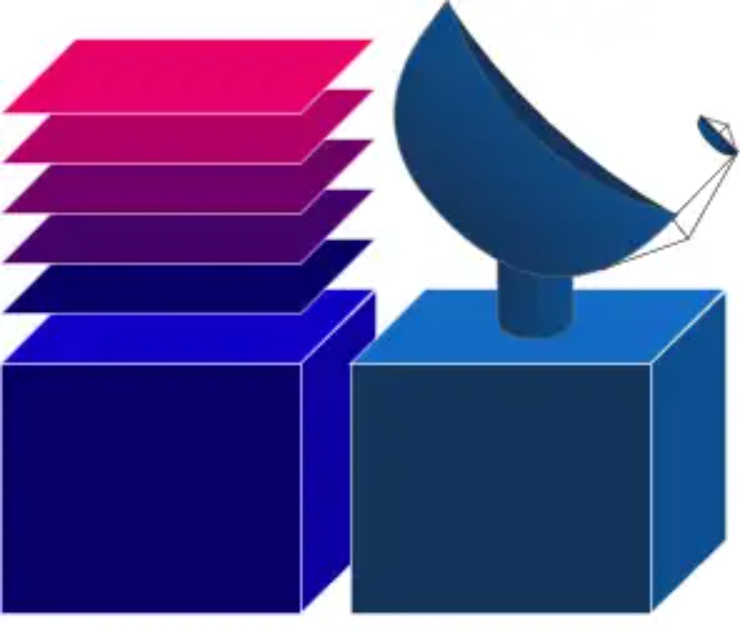

MsRaster
========

.. currentmodule:: applications

The visualization infrastructure of CASA will be built out by completing pathfinder
applications. These applications will build team knowledge and expand our codebase
as we encounter new opportunities and challenges. MsRaster is the second pathfinder
application for the :ref:`terminal usage setting <design-terminal-usage>`.

MsRaster is an application for 2-dimensional visualization and flagging of visibility and 
spectrum data.

Infrastructure
----------------------

Like :ref:`Interactive Clean <interactive_clean>`, MsRaster utilizes the :xref:`bokeh`
backend for plotting.  Bokeh has built-in plot tools allowing the user to zoom, pan,
select regions, inspect data values, and save the plot. Other libraries are
used for data I/O, plotting, and interactive dashboards:

* :xref:`xradio` (Xarray Radio Astronomy Data I/O), which implements the MeasurementSet
  v4.0.0 schema using :xref:`Xarray` to provide an interface for radio astronomy data

* Holoviz library :xref:`hvPlot` allows easy visualization of :xref:`Xarray` data objects
  as interactive :xref:`bokeh` plots

* Holoviz library :xref:`Holoviews` allows the ability to easily layout and overlay plots

* Holoviz library :xref:`panel` streamlines the development of apps and dashboards for
  the raster plots


.. image:: _static/hvplot.png
   :width: 100px
.. image:: _static/holoviews.png
   :width: 100px
.. image:: _static/panel.png
   :width: 100px

Implementation
---------------------

MsRaster gives the user flexibility to select data, plot styling, and plot layout.
The app can be used in three different ways from Python:

* to create plots exported to .png files

* to create interactive Bokeh plots to show in a browser window or notebook

* to create interactive Bokeh plots from a GUI dashboard in a browser window or notebook to select plot parameters

Data Exploration
````````````````

MsRaster includes an interface to explore the data with a summary of its metadata, list data
groups and antennas to aid in selection, and make plots of antenna positions and phase center
locations of all fields. These features are available in :xref:`xradio` and are exposed to the
user in this application.

Plot Parameters
```````````````

MsRaster has plot parameters to set plot axes and the visibility component, select data,
aggregate along one or more data dimensions, iterate along a data dimension, style the plot,
and layout multiple plots in a grid.  All parameters available from the MsRaster function calls
are also available in the GUI:

.. image:: _static/msraster_gui.png
