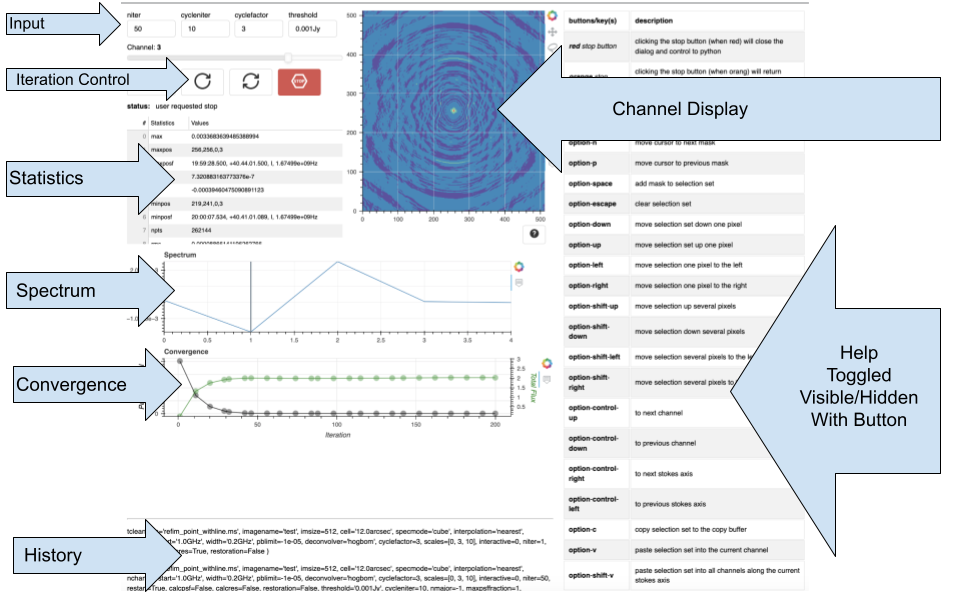

.. _design-system-design:

Interactive Clean Design
========================

.. currentmodule:: design

The interactive clean prototype is based upon the `Bokeh <https://docs.bokeh.org/en/latest/>`_
framework. This framework allow for the development of sophisticated plotting applications
in `pure-Python <https://stackoverflow.com/a/52461357>`_. Bokeh's Python libraries generate
JavaScript applications which are then displayed in a web browser. The approach allows for
the same GUIs to be used, with minor changes, in `Jupyter Notebooks <https://jupyter.org/>`_,
traditional web sites, and in desktop applications via `Electron <https://www.electronjs.org/>`_.

Traditional Approach
--------------------

In the past our GUIs have been very big C++/`Qt <https://www.qt.io/>`_ applications which
were monolithic, difficult to make script-able and complex to maintain.

They were monolithic because at the time when Qt was adopted having one GUI library that
could be built on different platforms and work with different windowing systems was a
big advance. To accomplish this task, an entire, low-level GUI widget library was created.
Applications built upon it needed to be built for each platform even though the Qt framework
was portable. These applications were stand-alone processes and because of this, they were
completely independent of the Python interpreter's process environment.

All *scripting* needed to be done by sending messages between the two, e.g.
:code:`open file browser` or :code:`go to channel 5`. It was difficult to integrate these
messages at a low enough level to be useful while still having them at a high enough level
for the Python interpreter process so that the user could do useful things without having
to write a significant scripts based on low level messages.

The maintenance complexity arises because the Qt applications are created at a very low
level. This results in precise control, but also a very large code base to maintain. For
example, the CASA viewer is built from 450379 lines of code that the CASA group maintains::

  github.com/AlDanial/cloc v 1.90  T=8.49 s (257.0 files/s, 84496.2 lines/s)
  -------------------------------------------------------------------------------
  Language                     files          blank        comment           code
  -------------------------------------------------------------------------------
  C++                           1062          53563          63941         337561
  C/C++ Header                  1004          36414         111750          81927
  Qt                              94              0              0          27056
  ProGuard                         1             25             24           1376
  Python                           9            199            372           1060
  Perl                             6             63             67            533
  LLVM IR                          1             40              0            302
  diff                             1             38            431            301
  XML                              2             59              0            235
  Markdown                         2             11              0             28
  -------------------------------------------------------------------------------
  SUM:                          2182          90412         176585         450379
  -------------------------------------------------------------------------------

In one respect, this is a **worst case** tally because it includes all of the CASA C++ code
upon which the viewer is based (including `casacore <https://github.com/casacore/casacore>`_).
However, this estimate is also **conservative** in the sense that it does not include
code that the viewer does not actually use (and does not include unused casacore code).

The situation for casaplotms is somewhat worse::

  github.com/AlDanial/cloc v 1.90  T=6.86 s (315.2 files/s, 122683.1 lines/s)
  -------------------------------------------------------------------------------
  Language                     files          blank        comment           code
  -------------------------------------------------------------------------------
  C++                           1082          69021          90887         405452
  C/C++ Header                  1031          42771         121012          94906
  Qt                              36              0              0           9385
  Python                           5            352            668           2924
  XML                              1            308              0           1555
  ProGuard                         1             27             19           1323
  Perl                             4             55             58            483
  Protocol Buffers                 1             25              0            206
  Markdown                         1              8              0             79
  -------------------------------------------------------------------------------
  SUM:                          2162         112567         212644         516313
  -------------------------------------------------------------------------------

Of these totals, the code that is specific to **only** the viewer is 69027 lines of
code and that specific to **only** plotms is 145780 lines of code. From either
perspective, each of these applications presents significant challenges for
build, packaging, maintenance and continuing improvements. A new approach is
required.

Framework Approach
------------------
To avoid the problems discussed to this point, we are attempting to take a new, modern
approach. The previous section outlines the challenges with our existing approach which
require a new approach. To try to chart a new course, the high-level choices we have
made are:

#. Use a framework that is implemented in **pure-Python**

#. Use a development framework that provides **higher level functionality** instead of
   low level widgets

#. Create **reusable tools** instead of specific applications

#. Use a framework that is **web-centric**

These changes have a number of good consequences.

A *pure-Python* implementation means that the applications we produce will work in a
similar way everywhere Python is available.  Direct integration with Python also means
that we will not experience all of the hurdles we have faced attempting to
make our existing GUIs scriptable. It also means that a packaging and
distribution mechanism exist to allow users to easily install our software
*along with all of its dependencies*. Better integration with the Python
ecosystem also means that things that are currently done in C++ code that CASA
maintains can instead be done using Python code that is maintained by the
Python community. This is a gradual process so over time we *should* continue
to reap greater rewards as our integration increases.

By choosing a framework that already provides *higher level functionality* that we
require, we can avoid implementing each part of the interface at a fine level of
detail. Because it is written in Python, the interface is also specified at a
higher level of abstraction than the C++ equivalent. In fact, these frameworks
are targeted at data science professionals. This means that over time it should
be much easier for some of our users to create GUIs using the framework which
can then be directly included into more general interfaces that can be delivered
to all of our users.

To avoid creating monolithic applications, we need to look for opportunities to
*create reusable tools* that can be used by a variety of applications. This
allows multiple end-user applications to share a common set of components, but
it also should extend the development framework in ways that customize it to
our domain. This process should then provide some framework components which
can be used directly by users who want to create custom GUIs.

By choosing a *web-centric* framework, we gain portability and generality.
Modern web browsers are self-contained visualization environments that are
available on all platforms. Using this instead of a large development library
like `Qt <https://www.qt.io/>`_ frees us from the need to compile our
application for each platform. It also increases our portability beyond
just platform portability. By using a web-centric framework, it is much
easier to make our GUIs available in
`Jupyter Notebooks <https://jupyter.org/>`_ or as a part of stand-alone
web-sites. This allows our applications to reach a wide variety of users.

While the advantages of this approach to GUI development vastly outweighs
the disadvantages, there are disadvantages. Free-standing applications are
set apart for desktop users by their nature. Mixing the CASA GUI in with all
of the other things that are done with web browsers causes the GUI to be
another tree in the forest. There are also performance ramifications. Due
in large part to all of the overhead, purpose-built, compiled applications
are very fast compared with just-in-time, on-the-fly web-centric applications
because much code is compiled dynamically as the application is loaded.
Using the framework directly from a Python interpreter depends on using
the web browser that is running on the same host. This is inconvenient
for remote use (user logs into a system and runs Python) because the web
browser must be displayed remotely with VNC or X11. This particular
problem can be resolved by using `Electron <https://www.electronjs.org/>`_
to create an application that runs on the user's local host with the
application controlling a Python kernel running on the remote host in
a model similar to Jupyter Notebooks.

Interactive Clean App
---------------------
The *interactive clean app* is the first test of this new approach. It
provides a simple GUI interface to
`tclean <https://casadocs.readthedocs.io/en/latest/api/tt/casatasks.imaging.tclean.html>`_.
To implement this, it uses
`CubeMask <https://casagui.readthedocs.io/en/latest/design/components/cube_mask.html>`_
component to provide most of the interaction, and adds extra widgets to
control :code:`tclean` and display convergence and statistics information.

Overview
````````
This diagram provides a view of the overall layout of the interactive clean
application:



Control
```````

The *control section* of the GUI provides the control panel for the sequence
of :code:`tclean` executions which will be run during an *interactive clean*
session:


The row of text boxes make up the *input section* which provides values for
the corresponding :code:`tclean` parameters:

* :code:`niter` - maximum number of iterations to run

* :code:`cycleniter` - maximum number of minor-cycle iterations

* :code:`cyclefactor` - scaling on PSF sidelobe level to compute the minor-cycle stopping threshold

* :code:`threshold` - stopping threshold (number in units of Jy or string)

The *channel slider* is provided by the
`CubeMask <https://casagui.readthedocs.io/en/latest/design/components/cube_mask.html>`_
component. It allows for changing the the channel being displayed. Changing to a different
channel results in all of the GUI elements being updated. The :code:`goto channel` text
dialog provides a way to go to a specific channel by entering the channel number and
pressing return.

The buttons provide controls to run **one** (*single arrow*) or **several** (*double arrow*)
:code:`tclean` runs. When the stop button is **red** as in this example, clicking the stop
button will cause the interactive clean browser tab to close, interactive clean will stop
in Python, and the *last set of masks* will be returned. But when the stop button is
orange:


clicking the stop button when it is **yellow** will cause iteration to stop after the
current :code:`tclean` run completes. The button color changes from **red** to **yellow**
when the *run several tclean iterations* button (*double arrow*) is clicked.

Convergence Quality
```````````````````
Each time interactive clean completes one iteration, as defined by the *input section*,
the convergence quality components are updated. These indicators include the
*convergence plot*:


This plot includes both *Peak Residual* and *Total Flux* plots. The statistics plot
includes image statistics for the channel currently being displayed:


Both of these are updated with the completion of each iteration and when the user
changes the displayed channel.

Spectrum Display
````````````````
Like the *channel slider*, the *spectrum display* is provided by the
`CubeMask <https://casagui.readthedocs.io/en/latest/design/components/cube_mask.html>`_
component:


This plot is updated as the cursor moves around in the channel display. Clicking in
the channel display freezes spectrum updates and then the *spectrum display* can be
used to go to a specific channel as indicated by the vertical cursor tracking line.
Clicking in the *spectrum display* will cause the channel display to go to the
channel indicated by the vertical cursor tracking line.

Implementation Details
``````````````````````
Like the new :code:`MakeMask` app, the :code:`InteractiveClean` app uses the
:code:`CubeMask` component to implement the display and interaction with the
*dirty image cube* created by :code:`tclean`. The
:doc:`CubeMask component <../components/cube_mask>` provides a collection of widgets
centered around image cubes. These widgets can be mixed into different
applications.

The :code:`InteractiveClean` application is available as part of the :code:`casagui`
Python package. This package is
`available from PyPI <https://pypi.org/project/casagui/>`_.
It can be installed like::

  bash$ pip install casagui

To run :code:`InteractiveClean` the :code:`casatasks` package must also be installed.

Once installed, the :code:`InteractiveClean` application can be imported and run from
the user's Python session like::

  >>> from casagui.apps import InteractiveClean
  >>> InteractiveClean( vis=ms_path, imagename=img, imsize=512, cell='12.0arcsec',
                        specmode='cube', interpolation='nearest', nchan=5, start='1.0GHz',
                        width='0.2GHz', pblimit=-1e-05, deconvolver='hogbom', threshold='0.001Jy',
                        niter=50, cycleniter=10, cyclefactor=3, scales=[0,3,10] )( )

In general, the :code:`InteractiveClean` constructor takes a subset of parameters accepted
by `tclean <https://casadocs.readthedocs.io/en/latest/api/tt/casatasks.imaging.tclean.html>`_.
All of the masks used in running interactive clean are available from the
:code:`InteractiveClean` object. To get access to the list of masks, you would create
the object as a separate statement::

  >>> ic = InteractiveClean( vis=ms_path, imagename=img, imsize=512, cell='12.0arcsec',
                    specmode='cube', interpolation='nearest', nchan=5, start='1.0GHz',
                    width='0.2GHz', pblimit=-1e-05, deconvolver='hogbom', threshold='0.001Jy',
                    niter=50, cycleniter=10, cyclefactor=3, scales=[0,3,10] )( )
  >>> ic( )
  >>> print(ic.masks( ))

In these examples, the :code:`InteractiveClean` function call (e.g. :code:`ic( )`) displays
the GUI that was specified in the :code:`InteractiveClean` object constructor. It is at this
point that the `asyncio <https://docs.python.org/3/library/asyncio.html>`_ eventloop is
started. This eventloop processes the events that are used to update the GUI, control the
:code:`tclean` invocations and finally stop and return control to the user.

When the `Bokeh <https://bokeh.org/>`_ framework is used for scripting from the Python prompt
it creates a GUI with all of the interactions that can be predefined at build time, but updates
from Python that cannot be predetermined (without, for example, loading in the whole image cube)
must be handled outside of Bokeh. Interactions that fall into this category are things like
updating the channel plot in response to user input or updating the convergence plot with
convergence information returned by :code:`tclean`. The communication for these updates is
handled with `websockets <https://websockets.readthedocs.io/en/stable/>`_. This is true for the
*cube display* functionality in :code:`CubeMask` as well as the additional functionality
that the interactive clean implementation adds. The communication for this added functionality
happens via two websockets:

* _control_ - pause or stop further calls to :code:`tclean`

* _convergence_ - update convergence quality plot

These are two separate websockets to ensure that _control_ messages are not delayed due
to convergence information updates from :code:`tclean` executions. More information about
:code:`CubeMask` is available in the :doc:`its design document <../components/cube_mask`.

In response to control commands from the interactive clean GUI, :code:`tclean` is called
in Python when the websocket events are received. The results are then transferred to the
browser to update the GUI and the process repeats.

Future Work
```````````
The fundamental work that remains for the *interactive clean* application involves using
the `IPython Jupyter Kernel <https://ipython.readthedocs.io/en/stable/install/kernel_install.html>`_
as the process which runs :code:`tclean`. This seems like it should be possible with no
significant, known problems. Early in our abbreviated trade study, we tested this with
a simpler example (:code:`plotants`) without significant issues. Making this functionality
available means that interactive clean could be used from a Jupyter Notebook and it could
be integrated into a stand-alone, desktop app based on `Electron <https://www.electronjs.org/>`_.
Both of these were tested in the trade study. The final step that was not tested in the
trade study is :code:`tclean` executing in a **remote** IPython Kernel. The documentation
indicates that this should be possible. Once this is available, it will be possible to
start a desktop application which then runs CASA tasks in a remote kernel executing on
an NRAO cluster (or other compute resource).
