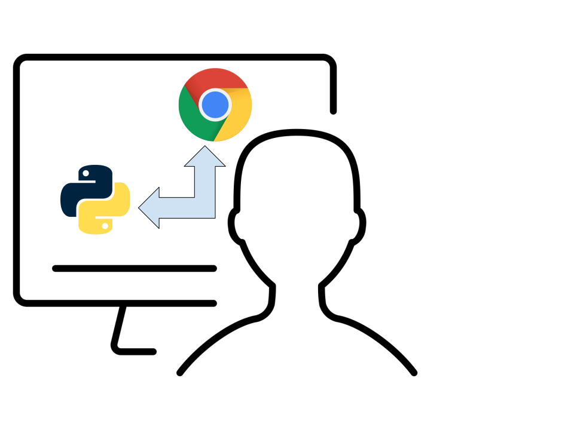

.. _design-system-design:

CASA/Viz Boundary
====================

.. currentmodule:: design

This document describes the boundary between CASA (including CASA7 and future versions of
CASA). It is necessarily a high-level view of the principles of this boundary. However,
it is important to layout the system level view of this boundary to prevent choices being
made in the system design of other parts of the CASA and NRAO ecosystem.

For this discussion, only two execution modes will considered. While the introduction describes
the "Usage Settings" where we envison casagui being used. The "Usage Settings" describe
the user context where CASA operates. The "Execution Modes" is the level below the "Usage Settings".
This lower level is discussed here to motivate some constraints that are implied by the
the implementaton which will support the "Usage Settings".

In all of this current discussion, the assumption is that there is a GUI and that it is always
running on the user's device. In practice, this means that the GUI will be presented in the
user's browser. The execution that we are talking about is the execution process that creates
images, provides storage for images, modifies images, or collates and organizes data. These
processes could also be on the user's device, but they could also be running on remote systems.

Local Execution
-------------------

With local execution, there is a local Python process which executes all of the image and data
processing code. Communication between this Python process and the GUI code in the browser is
accomplished with :xref:`websocket`. The user interacts with the elements of the GUI within
the browser. These interactions result in :xref:`websocket` messages sent to the local Python
environment. Within the Python environment, the interfaces provided by CASA and other packages
is used to accomplish the desired processing, and the results are then returned to the GUI
via websockets.

Remote Execution
-------------------

Remote execution allows the user to start the GUI locally but perform the desired processing
tasks on a remote system which the user can access with SSH. To start a remote processing
execution, the user would first start a local Python session and then start the GUI element
specifying the remote host that should be used. The GUI will start and run locally, but
instead of the local Python session being used to perform the processing it will start
a remote :xref:`jupyterkernel` on the specified remote system. Messages sent to the local
Python session from the GUI via :xref:`websocket` will be converted to :xref:`jupyterprotocol`
messages sent to the remote kernel. These messages will then run the process using the same
interfaces provided by CASA and other packages as was used for local execution.

