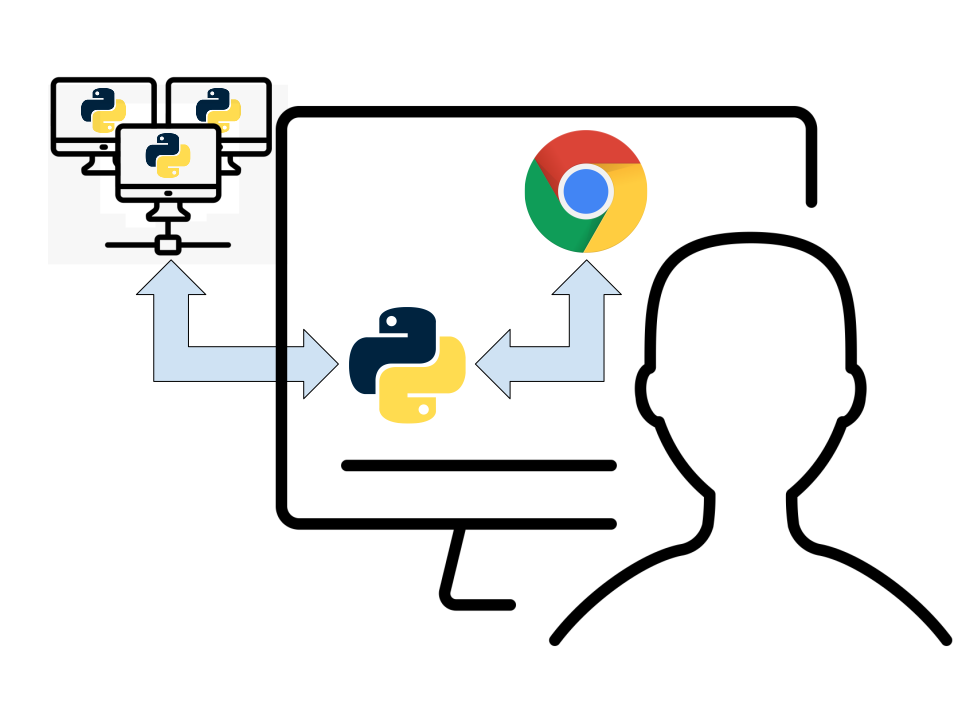

.. _design-system-design:
.. role:: red
.. role:: blue

CASA/Viz Boundary
====================

.. currentmodule:: design

This document describes the boundary between CASA (including CASA7 and future versions of
CASA). It is necessarily a high-level view of the principles of this boundary. However,
it is important to layout the system level view of this boundary to prevent choices being
made in the system design of other parts of the CASA and NRAO ecosystem.

For this discussion, only two execution modes will considered. While the introduction describes
the "Usage Settings" where we envison casagui being used. The "Usage Settings" describe
the user context where CASA operates. The "Execution Modes" is the level below the "Usage Settings".
This lower level is discussed here to motivate some constraints that are implied by the
the implementaton which will support the "Usage Settings".

In all of this current discussion, the assumption is that there is a GUI and that it is always
running on the user's device. In practice, this means that the GUI will be presented in the
user's browser. The execution that we are talking about is the execution process that creates
images, provides storage for images, modifies images, or collates and organizes data. These
processes could also be on the user's device, but they could also be running on remote systems.

Local Execution
-------------------

.. image:: _static/local_execution.svg
           :align: left
           :width: 220px

With local execution, there is a local Python process which executes all of the image and data
processing code. Communication between this Python process and the GUI code in the browser is
accomplished with :xref:`websocket`. The user interacts with the elements of the GUI within
the browser. These interactions result in :xref:`websocket` messages sent to the local Python
environment. Within the Python environment, the interfaces provided by CASA and other packages
is used to accomplish the desired processing, and the results are then returned to the GUI
via websockets.

Remote Execution
-------------------

Remote execution allows the user to start the GUI locally but perform the desired processing
tasks on a remote system which the user can access with SSH. To start a remote processing
execution, the user would first start a local Python session and then start the GUI element
specifying the remote host that should be used. The GUI will start and run locally, but
instead of the local Python session being used to perform the processing it will start
a remote :xref:`jupyterkernel` on the specified remote system. Messages sent to the local
Python session from the GUI via :xref:`websocket` will be converted to :xref:`jupyterprotocol`
messages sent to the remote kernel. These messages will then run the process using the same
interfaces provided by CASA and other packages as was used for local execution.

These two execution models will are sufficient as the basis for the usage settings described
in the casagui system document. A variant of these execution models may also be sufficent
for a website implementation. The GUI elements created with :xref:`bokeh` are compatible
with display within a website. The remote :xref:`jupyterkernel` execution is compatible
with processing initiated from a website. The details of the execution model between a
public website portal and the backend execution model lies outside of the CASA/casagui
context.

Implications
----------------

The varied usage and execution environments make it difficult to provide sufficient testing
for casagui. To ameliorate these difficulties, it is important to push as much functionality
down into the processing level as possible. Doing this maximizes the testing of functionality
as part of processing level testing. This testing is independent of GUI elements.

The second implication arises from supporting remote execution. Because processing results
must be serialized and returned via :xref:`websocket` and displayed within a browser, the
processing interface must be defined in terms of basic Python types or types which can be
converted to basic Python types. An example of the latter is :xref:`numpy` arrays. The
interactive clean app uses :xref:`numpy` arrays to represent the images which are displayed
within :xref:`bokeh`.

Example
----------------

This is drafted as the first version of interactive clean nears release. This initial release
will **not** include remote execution, but its design does attempt to conform to the constraints
which remote execution requires.

The parameters and processing results are transferred from Python to a web browser for display.
As a result, they are serializable.

Interactive clean uses a very limited portion of the public interface or perhaps this is better
termed an interface treated as public. This caveat is included because the processing interaction
is encapsulated within :xref:`gclean`. This allows for testing of the process that supports the
GUI. The public process API from CASA that interactive clean depend upon is :xref:`gclean` and
the :code:`shape`, :code:`maskhandler`, :code:`coordsys`, :code:`getregion`, :code:`fitsheader`,
:code:`getchunk`, :code:`putchunk` and :code:`statistics` functions of the :xref:`imagetool`.

gclean
^^^^^^^^^^^^^^^^

:xref:`gclean` is a Python class which encapsulates the process layer of interactive clean. It
allows for automated testing of all of the process interface of interactive clean as part of
the standard (non-interactive) testing of the process layer. It implement the functionality
of :xref:`tclean` in a way that is usable by interactive clean. Scientifically the behavior of
:xref:`gclean` is equivalent to :xref:`tclean`, but modifying :xref:`tclean` is difficult because
it is used extensiviely in a production environment.

A :xref:`gclean` object is constructed with the subset of :xref:`tclean` parameters which are
relevant to interactive use. It implements a Python generator which returns a series of
:xref:`returndict`. This dictionary is a regular python dictionary which accumulates information
as processing progresses. :xref:`gclean` deviates somewhat from the typical generator by
including an :code:`update` function which accepts a dictionary of parameters to change for
the next generation step. These parameters are the modifications the user has indicated from
the interactive clean GUI.

Internally, :xref:`gclean` uses the :xref:`tclean` and :xref:`deconvolve` tasks to perform
model image based reconstruction of interferometer data. The steps that are performed are

    :green:`construct gclean object` -- :code:`cl = gclean(...)` the :xref:`gclean` object is
    constructed with a subset of :xref:`tclean` parameters. Internal state is initialized,
    but no processing is done.

    :green:`retrieving next convergence dictionary` -- :code:`next(cl)` the imaging iterations
    are controlled by the stopping criteria :code:`niter`, :code:`cycleniter` and
    :code:`threshold`. The next dictionary will be returned after the stopping criteria
    are met, after one major cycle is complete or after an error is encountered. The
    :code:`mask` which is provided specifies the area of the image cube to which the
    imaging algorithm should be applied. If no :code:`mask` is supplied, no processing
    is performed.

    :green:`modifying stopping criteria` -- :code:`cl.update( {...} )` the purpose of
    interactive clean is to allow for adjustments to the :code:`mask` and control
    parameters as processing progresses. This adjustment can be done before each
    successive convergence dictionary is returned. This update is optional and
    retrieving all dictionaries generated is expected to create the same final
    image as running :xref:`tclean` with no pauses in processing. The entries which
    can be supplied in the dictionary parameter are :code:`niter`, :code:`cycleniter`,
    :code:`niter`, :code:`nmajor`, :code:`threshold`, and :code:`cyclefactor`.
    :code:`update` returns a tuple composed of an error code and a message.
    The first element of the tuple (error code) is zero if the update was
    successful and negative one if the update failed. If the update failed,
    the message contains an error message.

    :green:`creating restored image` -- :code:`cl.restore( )` called after the completion
    of the :xref:`gclean` processing. This creates the final, restored image and
    returns a dictionary which contains an :code:`image` field whose value is the
    path to the restored image.

The typical interactive clean patern of :code:`gclean` usage is::

  cl = gclean( )
  retdict = next(cl)
  while user_continues( ):
      cl.update( user_parameters( ) )
      retdict = next(cl)
  cl.restore( )

where :code:`user_continues` is the handles checking if the user wishes to stop and
:code:`user_parameters( )` fetches updates to the control parameters from the user.
