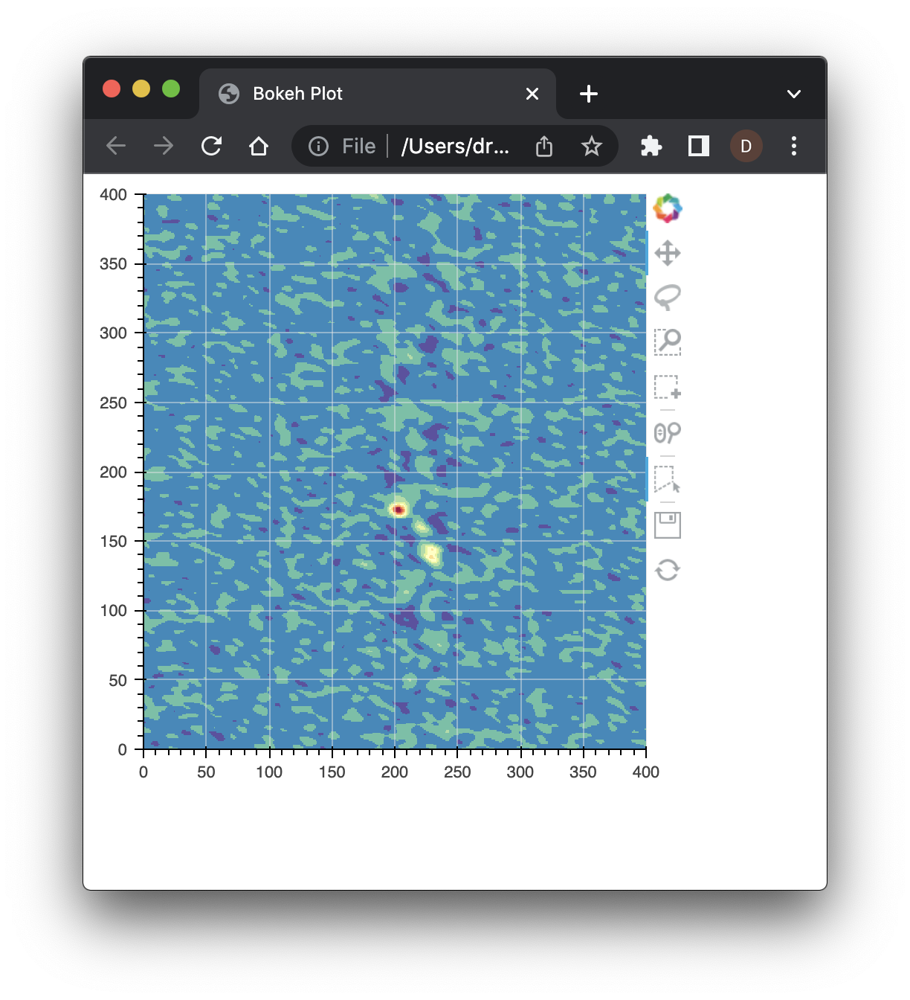
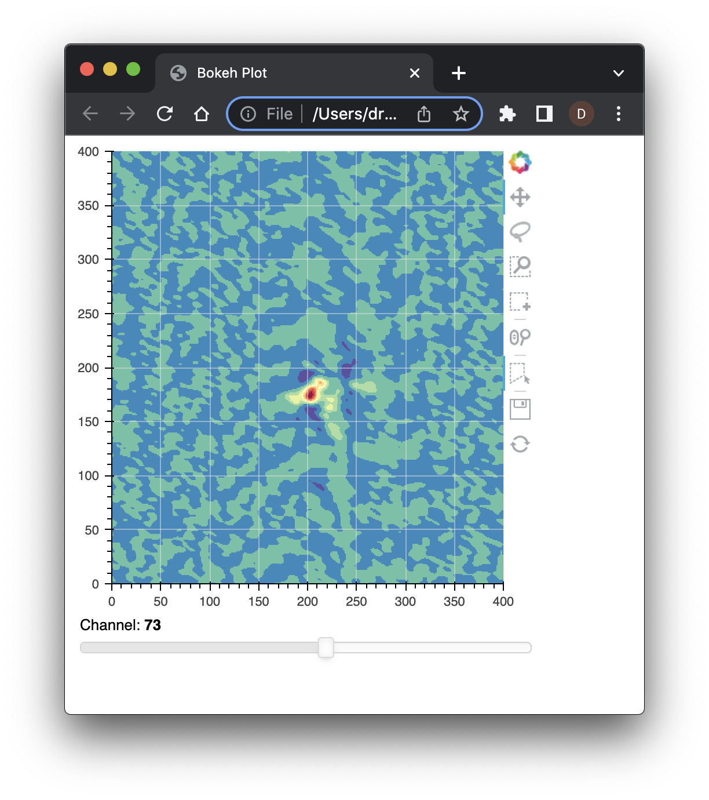
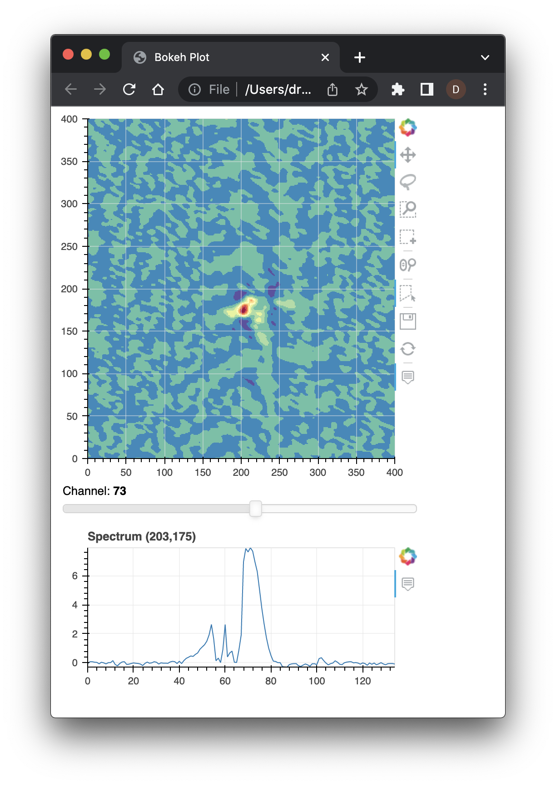
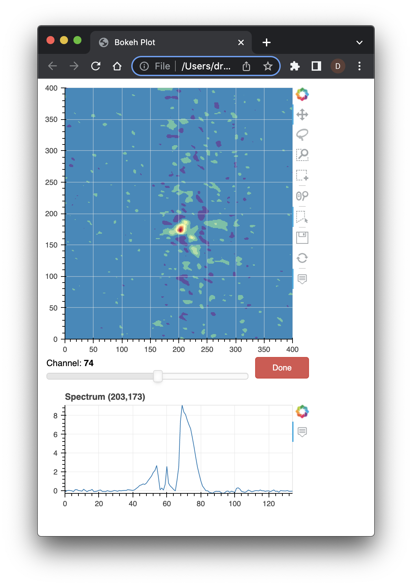
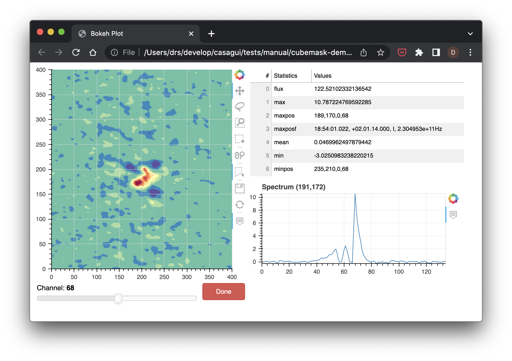

.. _design-system-design:

====================
Cube Mask Design
====================

.. currentmodule:: design

The cube mask toolkit is a group of related components that can be used to construct different
GUIs related to image cube applications. Application builders do not need to adopt all of the
lements in this collection. A few of the widgets can be used or all can be used. The only
component that must be used is the ``image`` widget. This component is the central image cube
display window which includes the ability to step through the channels of the image cube, and
it is the users interaction with this component that drives the other component.

Image
====================

An image cube can be displayed with this code::

  import asyncio
  from bokeh.plotting import show
  from bokeh.layouts import row, column
  from bokeh.models import Button, CustomJS
  from casagui.toolbox import CubeMask

  cube = CubeMask( 'g35_sma_usb_12co.image' )
  image = cube.image( )
  cube.connect( )
  show( image )

  try:
      loop = asyncio.get_event_loop( )
      loop.run_until_complete(cube.loop( ))
      loop.run_forever( )
  except KeyboardInterrupt:
      print('\nInterrupt received, stopping GUI...')

  print( f"cube exited with {cube.result( )}" )

The ``image`` function creates a two-dimensional plot that displays one channel from the
image cube which was passed in as a constructor parameter. Even without any controls the
image display can be used to create regions and move through the channels of the cube
(Option-Ctrl-Up on MacOS and Alt-Ctrl-Up on Linux moves to the next channel).

The image update is managed via the ``asyncio`` event loop. The tools along the edge
can be used to draw regions, scroll, pan, zoom, etc. The regions are accessable after
successful completion of GUI interactions. The image used in these examples is
`available for download
<https://casa.nrao.edu/download/devel/casavis/data/g35-12co-img.tar.gz>`_.
Channel Scrolling
====================
The ``CubeMask`` object provides access to other GUI components that are integrated with
the image display. Scrolling with a slider that makes traversing the channels much easier,
and it can be added, assuming the same imports as above, like::

  cube = CubeMask( 'g35_sma_usb_12co.image' )
  layout = column( cube.image( ),
                   cube.slider( ) )
  cube.connect( )
  show( layout )

  try:
      loop = asyncio.get_event_loop( )
      loop.run_until_complete(cube.loop( ))
      loop.run_forever( )
  except KeyboardInterrupt:
      print('\nInterrupt received, stopping GUI...')

  print( f"cube exited with {cube.result( )}" )

The component usage is indicated by calling the accessor functions, e.g. ``image`` or
``slider`` here, and the call to the ``connect`` member function connects the *behind
the scenes* connections to make all of the elements (*that are in use*) interact and
update in response to user input.

Spectra (Z-Axis) Display
========================
Another useful component included in ``CubeMask`` is the spectra display. This display
shows the image spectra along the z-axis of the image cube. As with ``slider`` above
the spectra display is accessed with the ``spectra`` member function::

  cube = CubeMask( 'g35_sma_usb_12co.image' )
  layout = column( cube.image( ),
                   cube.slider( ),
                   cube.spectra( width=400 ) )
  cube.connect( )
  show( layout )

  try:
      loop = asyncio.get_event_loop( )
      loop.run_until_complete(cube.loop( ))
      loop.run_forever( )
  except KeyboardInterrupt:
      print('\nInterrupt received, stopping GUI...')

  print( f"cube exited with {cube.result( )}" )

By default, the spectra display is wider, but these components generally support the
same parameters supported by the underlying Bokeh components. In this case, the ``width``
is specified.

Integration with Bokeh
======================
While we have already seen some integration with Bokeh models, e.g. ``layout`` above,
It is also possible to include reactive models. The ``js_obj`` member function provides
access to control elements of the ``CubeMask`` components. This example shows how this
interface can be used to close the GUI, exit the event loop and return control to
Python::

  cube = CubeMask( 'g35_sma_usb_12co.image' )
  done = Button( label="Done", width=80, button_type="danger" )
  layout = column( cube.image( ),
                   row( cube.slider( ), done ),
                   cube.spectra( width=400 ) )
  done.js_on_click( CustomJS( args=dict( obj=cube.js_obj( ) ),
                              code="obj.done( )" ) )
  cube.connect( )
  show( layout )

  try:
      loop = asyncio.get_event_loop( )
      loop.run_until_complete(cube.loop( ))
      loop.run_forever( )
  except KeyboardInterrupt:
      print('\nInterrupt received, stopping GUI...')

  print( f"cube exited with {cube.result( )}" )

This example adds a button to invoke the completion function of the
``CubeMask`` JavaScript control object which is returned by the
``js_obj`` function. The ``code`` in this example is JavaScript
rather than Python code, and the execution takes place in the
browser displaying our GUI.

Channel Statistics
====================
The channel statistics widget provides statistics information about
the current channel displayed and it updates along with the channel
displayed in the ``image`` widget. It is incorporated into the
display just like all of the other elements::

  cube = CubeMask( 'g35_sma_usb_12co.image' )
  done = Button( label="Done", width=80, button_type="danger" )
  layout = row( column( cube.image( ),
                        row( cube.slider( ), done ) ),
                column( cube.statistics( ),
                        cube.spectra( width=400 ) ) )

  done.js_on_click( CustomJS( args=dict( obj=cube.js_obj( ) ),
                              code="obj.done( )" ) )
  cube.connect( )
  show( layout )

  try:
      loop = asyncio.get_event_loop( )
      loop.run_until_complete(cube.loop( ))
      loop.run_forever( )
  except KeyboardInterrupt:
      print('\nInterrupt received, stopping GUI...')

  print( f"cube exited with {cube.result( )}" )

Here the elements have been rearranged to so how easy it is to organize
the display.

Implementation
====================
The ``CubeMask`` implementation uses the Bokeh `figure
<https://docs.bokeh.org/en/latest/docs/reference/plotting/figure.html?highlight=figure#bokeh.plotting.figure>`_
to implement the image and spectra display. It also uses `Slider
<https://docs.bokeh.org/en/latest/docs/reference/models/widgets/sliders.html?highlight=slider#bokeh.models.Slider>`_ and
`DataTable
<https://docs.bokeh.org/en/latest/docs/reference/models/widgets/tables.html?highlight=datatable#bokeh.models.DataTable>`_.
These are updated from Python using `websockets
<https://websockets.readthedocs.io/en/stable/>`_ to request (from GUI) and receive (from Python) the data updates
for the GUI elements.

Two websockets are used by ``CubeMask``. One websocket is devoted to updating the image and statistics, which
are both updated with the same message. The other websocket is used for control. Currently, just signaling
that the GUI should shutdown, but later it may be used for other control messages.

Conclusion
====================
In addition to the elements shown above there is a ``help`` text box which
can be used to provide a description of how to interact with the ``CubeMask``
interfaces. This text box can be added to the GUI and shown and hidden as
desired.

The goal of the design of ``CubeMask`` is to incorporate added functionality
that is specific to our use case without interfering with the the integration
of these elements into Bokeh displays. This means that the Bokeh elements must
be exposed while also adding our extensions behind the scenes.
