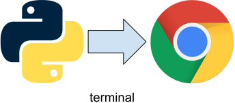
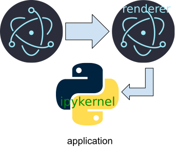
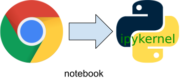

.. _design-system-design:

System Design
====================

.. currentmodule:: design

This design document describes the history, motivation and design of the casagui
system. This system includes the casagui Python package and the casagui application
framework. The casagui Python package is used by pipeline developers and other Python
users to access casagui functionality from Python. The casagui application framework
also uses the casagui Python package. The design of the casagui system allows the
same Python functions to generate raster files for pipeline use, plots for Python
users, and the visualization elements that are included in CASA desktop applications.
Having a single implementation ensures consistency and minimizes development and maintenance.

Usage Settings
-------------------

In addition to the desire to have a single implementation to provide the core visualization
functionality, there are four settings where the single Python implementation will have
to function. All of the casagui functionality will **not** be available in all of these
settings, but some subset will be available in all settings. The limits on applicability
come from setting limitations (headless operation precludes direct user interaction) as
well as platform limitations (Jupyter notebook model centers around evaluating a cell and
receiving a response). We navigate these limitations as the casagui system is built out
with new GUI elements. The rest of this section will outline the usage settings for the
casagui system.

Headless
^^^^^^^^^^^^^^^^^

In many applications, user interaction is not possible. A display may not exist or it may
not be accessible. One important area that the casagui system must support is pipeline
processing of data collected from radio telescopes. This processing happens after the data
is collected by the online system and it generates the observation artifacts that are
provided to investigators.

In the headless setting, the only process involved from the casagui perspective is the
Python process that imported the casagui Python package, and the only display option
available is the generation of raster files (png, jpg, etc.).

.. _design-terminal-usage:

Terminal
^^^^^^^^^^^^^^^^

The terminal setting is the typical Python usage setting. In this case, the user interacts
with Python interactively, e.g. with IPython, or by running Python scripts from a terminal.
A display is available, but no other support processes are available. The user has installed
the casagui package into their python environment using something like pip, but because we
want to avoid OS specific binary applications all casagui functionality in this setting is
implemented in Python, and the frameworks which can be leveraged in the implementation are
also implemented in Python. These individual frameworks may provide OS specific
implementations, but casagui Python package is isolated from the incompatibilities which
such implementations entail.

In the terminal setting, the user’s web browser is the best display option. It is (hopefully)
compatible with the casagui application framework, and the user already has a browser that
they use that is suitable for display. It is possible that some Python visualization packages
also include a server for displaying information, and in some cases, this may be the only
option. However, the only processes that are available in the terminal setting are those
that the user is expected to have (browser) and those that come with standard Python packages.

Application
^^^^^^^^^^^^^^^^

The application setting is in some respects a new setting for CASA. Although CASA has had
applications in the past, e.g. casaviewer, casaplotms, etc., these have been purpose built
applications that were implemented separately from the main CASA Python application. Typically
these applications would leverage some portion of the C++ code that underlies the
implementation of the casatools. This implementational separation from Python made it
difficult to implement a Python scripting interface for the purpose built, stand-alone
applications. The casagui system takes a different approach. The casagui Python package is
leveraged, along with an application framework, to create a platform for hosting all of the
visualization applications created as part of the casagui system. All of these applications
will be hosted by a single, running instance of the application framework. This is possible
because the framework is built on Chromium, the same application framework that underlies the
Google Chrome browser. This application framework is called Electron.

In the application setting, we have much more flexibility and control than in any of the other
settings. Here we leverage the Jupyter Protocol and the IPython kernel that goes along with it.
The **same** casagui python package used in the other settings is imported into the IPython
kernel and generates the visualization elements that go into producing standalone applications
like plotms. These applications are too complex to be implemented using currently available
python frameworks, but by using Electron and the tools that are available in
TypeScript/JavaScript the same plots that are available to users in the other settings can be
incorporated into much more capable and wide ranging applications in this setting. A plot that
is generated in the headless setting for saving to a raster file will be identical to the same
plot displayed in our Electron application, and they will use the same Python implementation
to do it.

Notebook
^^^^^^^^^^^^^^^^^^^^^^^^^

The GUI elements available in the notebook setting will be a subset of those available in the
application setting. However because our application framework and Jupyter notebooks share the
same underlying protocol, many of the plots generated by the common casagui Python package will
just automatically work in the notebook setting. While notebooks are very useful for collaboration
and documentation, this is the least important of the usage settings we are targeting, but we
structured our architecture to support notebook display as much as possible.

This setting is less general than the application setting. When users interact with a Jupyter
notebook, they may not realize that there is an execution context (typically Python) underlying
the notebook web page. Here our process diagram (above) looks below the surface to expose the
similarities between the notebook setting and our application setting. They share a communication
protocol and an execution environment in common.

The notebook setting is constrained by the limitations of the Jupyter notebook architecture.
Most of the individual plots that the casagui Python package is capable of creating should
display fine within a notebook. The very complicated applications which can be created in the
application setting will not be available in the notebook setting.

Design Documents
-------------------

The casagui design documents are available for more detailed discussions about the implementation
of specific tools and applications.

.. toctree::
   :maxdepth: 3
   :caption: Applications:

   boundary
   applications/interactive_clean
   ../python/casagui

.. toctree::
   :maxdepth: 3
   :caption: Component Toolbox:

   components/cube_mask
